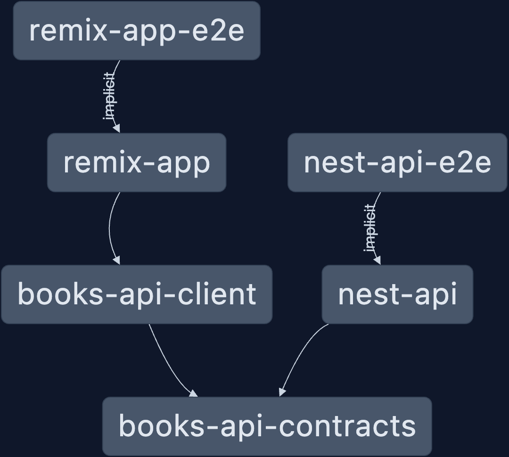

## Nx demo

An introduction to Nx.

## What we are building

A books library app.

### Technologies

- [Nx](https://nx.dev/getting-started/intro#try-nx-yourself)!

And...

- backend: [nestjs](https://docs.nestjs.com/)
- frontend: [remix](https://remix.run/docs/en/main)
- request / response validation: [zod](https://zod.dev/)
- end-to-end tests: [playwright](https://playwright.dev/docs/intro)
- tests: [vitest](https://vitest.dev/guide/)
- bundler: [vite](https://vitejs.dev/guide/)
- orm: [mikro orm](https://mikro-orm.io/docs/guide)
- database: [postgres](https://www.postgresql.org/)

But note that we are never restricted to any of these choices. We can start any new project
in this repo with any of [the supported tooling / frameworks](https://nx.dev/nx-api#official-packages-reference).

The above tools are listed so that we can make consistent choices. Whenever there is a reason for it, please pick another
that fits the job better.



## Create nx workspace

```sh
npx create-nx-workspace@latest nx-demo

Need to install the following packages:
create-nx-workspace@19.6.4
Ok to proceed? (y)


 NX   Let's create a new workspace [https://nx.dev/getting-started/intro]

✔ Which stack do you want to use? · none
✔ Package-based monorepo, integrated monorepo, or standalone project? · integrated
✔ Which CI provider would you like to use? · github

 NX   Creating your v19.6.4 workspace.

✔ Installing dependencies with npm
✔ Successfully created the workspace: nx-demo.
✔ Nx Cloud has been set up successfully
✔ CI workflow has been generated successfully

—————————————————————————————————————————————————————————————————————————————————————————————————————————————————————————————————————————————————————————————————————————————————————————————————————————————————————


 NX   Nx CLI is not installed globally.

This means that you will have to use "npx nx" to execute commands in the workspace.
Run "npm i -g nx" to be able to execute command directly.


 NX   Your CI setup is almost complete.

Finish it by visiting: https://cloud.nx.app/connect/4bBQtKTPG8


—————————————————————————————————————————————————————————————————————————————————————————————————————————————————————————————————————————————————————————————————————————————————————————————————————————————————————


 NX   First time using Nx? Check out this interactive Nx tutorial.

https://nx.dev/getting-started/tutorials/npm-workspaces-tutorial

```

> Package-based monorepo, integrated monorepo, or standalone project? · integrated

```sh
cd nx-demo
```

### Integrated vs package based vs standalone

### Nx cloud

## Install plugins

See a [list of official packages](https://nx.dev/nx-api#official-packages-reference)

```sh
npx nx add @nx/remix
npx nx add @nx/node
npx nx add @nx/nest
```

## Generate applications

```sh
npx nx g @nx/remix:application \
  --directory apps/remix-app \
  --name remix-app \
  --projectNameAndRootFormat as-provided \
  --unitTestRunner vitest \
  --e2eTestRunner playwright
```

## Navigate the nx workspace

```sh
npx nx show project remix-app
```

> nx run [project][:target][:configuration]

```sh
npx nx run remix-app:dev
```

## Generate libraries

### Publishable

If you are planning to publish your package to a registry, you should use both `--publishable` and `--importPath` when generating the library. See also Nx docs for [publishable libraries](https://nx.dev/concepts/buildable-and-publishable-libraries#publishable-libraries).

```sh
# Example publishable library
npx nx g lib books-api-client \
  --publishable \
  --importPath @nx-demo/books-api-client \
  --directory libs/books-api-client \
  --projectNameAndRootFormat as-provided \
  --unitTestRunner vitest \
  --bundler vite
```

```sh
# Example non publishable library
npx nx g lib books-api-client \
  --directory libs/books-api-client \
  --projectNameAndRootFormat as-provided \
  --unitTestRunner vitest \
  --bundler vite
```

### Buildable

You can choose for either [buildable or non buildable libraries](https://nx.dev/concepts/buildable-and-publishable-libraries#buildable-libraries).

I almost always go for buildable, since it doesn't bring any overhead for generating the required tooling, and nx will keep it up to date whenever a migration is required. It might be overkill for smaller projects, but it will allow your repo to scale without ever have to worry about it.

```sh
# use vite / vitest when prompted
npx nx g @nx/js:lib api-client
```

## Workspace tools

Everyone is free how to organise their monorepo.

### Move a project

Move api-client from root folder to subfolder in `libs` folder.

```sh
# We created the api-client project in the root of our repo
# instead of in the `libs` folder. Let's move it.
npx nx generate @nx/workspace:move \
  --project api-client \
  --destination libs/books-api-client \
  --newProjectName books-api-client \
  --projectNameAndRootFormat as-provided
```

## Override inferred targets

```sh
npx nx show project remix-app
```

Copy the target and paste in in `apps/remix-app/project.json` under 'targets'

```json
  "targets": {
    "dev": {
      "options": {
        "cwd": "apps/remix-app",
        "command": "remix dev --manual"
      },
      "executor": "nx:run-commands",
      "configurations": {},
      "parallelism": true
    }
  }
```

## Embrace .env files

Nx can handle multiple .env files where one can add project defaults in a `.env` file.
This file can be commited to source control. `.env` files should never contain secrets (or be encrypted).

For more details about how these files are process see: https://nx.dev/recipes/tips-n-tricks/define-environment-variables#set-environment-variables

## @nx/dependency-checks

Since all our dependencies are managed by the root package.json file,
it would be hard to manually keep track of which project really needs which dependencies.
Luckly this is something we do not have to worry about since nx provides us with a
eslint rule to automatically detect the dependencies of a project and update the projects package.json
for us.

Running linting on this repo currently shows:

```sh
../nx-demo/libs/books-api-contracts/package.json
        4:3  error  The "books-api-contracts" project uses the following packages, but they are missing from "dependencies":
          - zod  @nx/dependency-checks

      ✖ 1 problem (1 error, 0 warnings)
        1 error and 0 warnings potentially fixable with the `--fix` option.

```

All we need to do is:

```sh
npx nx run-many lint -- --fix
```

## Publishing

Use the `setup-verdaccio` generator from `@nx/js` to configure a local npm registry to test versioning / publising.

```sh
npx nx generate setup-verdaccio
```

Before you start the registry, adjust the configuration in `project.json`.

```json
    "local-registry": {
      "executor": "@nx/js:verdaccio",
      "options": {
        "port": 4873,
        "config": ".verdaccio/config.yml",
        "storage": "tmp/local-registry/storage",
        "//": "default location is user, but let's keep all our config close to it's origin",
        "location": "project",
        "//": "only use the local registry for our own packages",
        "scopes": ["@nx-demo"]
      }
    }
```

Start local verdaccio registry

```sh
npx nx run local-registry
```

## Versioning

```sh
npx nx add @nx/js
```

See `release` section in [nx.json](./nx.json) for configuration settings.

Note that you can also use `nx release` in any non Nx monorepo.

`nx release` actually wraps tree sub commands

- nx release version
- nx release changelog
- nx release publish

Each of these commands can be run seperately (and also programatically if you feel the need to customize it more or implement it in other tooling).

```sh
npx nx release

# other scripts
## First ever release in the repo
npx nx release --first-release

## Useful for ci, won't prompt for publish confirmation
npx nx release --yes
```

### Use nx to version both packages and applications

This is where things become more interesting. NX is mainly focussed on CI. But we could also leverage the versioning feature to
version applications as well and use this version for tagging build artifacts and deploying specific versions.

To do this we need to differentiate packages from applications.
One way to differentiate would be to treat all projects in the `apps` folder as an application. However,
this folder might also contain other projects that do not need to be versioned such as `my-app-e2e`.

Therefor I suggest to use project tags. How you tag them is totally up to you but here I'll use `type:package` and `type:app`.

Another thing we need to do is seperate the `publish` phase from the `version` and `changelog` phase.

For versioning and changelog generation, both packages and apps will be treated the same.
For publishing, obviously we only do this for packages.

Note, it's always a good idea to add `"private": true` to your `package.json` files of your applications to prevent any tool from publishing applications to a possibly public registry.

So eventually, our script will something like this:

```
# Bump versions and generate changelogs
npx nx release --skip-publish [--first-release]
# Publish packages
npx nx release publish --projects tag:type:package
```

## Dependency management

Single version (Nx) vs Independently Maintained Dependencies (Any other monorepo)

https://nx.dev/concepts/decisions/dependency-management

## Project organisation and best practices

### Project types

https://nx.dev/concepts/decisions/project-dependency-rules

- ui
- data-access
- feature
- util

Dependency rules can be enforced based on Nx project tags using `@nx/enforce-module-boundaries` eslint rule.

```
# Rename remix-app to books-app
npx nx generate @nx/workspace:move --project remix-app --destination apps/books-app --projectNameAndRootFormat as-provided --newProjectName books-app

# Rename remix-app-e2e to books-app-e2e
npx nx generate @nx/workspace:move --project remix-app-e2e --destination apps/books-app-e2e --projectNameAndRootFormat as-provided --newProjectName books-app-e2e
```
